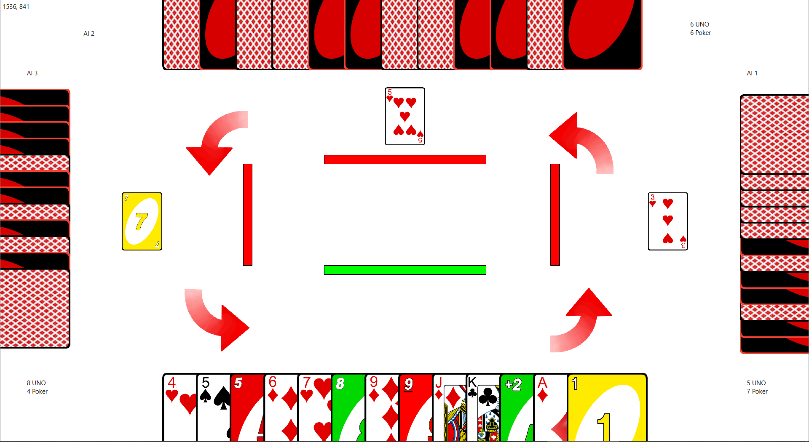

## Big TwUNO

This is a logic card game for 2 to 4 players, implementing the general rules of a traditional game Big Two but also added some elements of UNO into it, thus named Big TwUNO. 

### To play the game:
Download the GraphicsScene folder. Open and run GraphicsScene.pro in QT Creator. 

#### In the Starting Window:

There are 4 buttons:

- ```Create Room```: For the 1st player to create a room for other players to join

- ```Join Room```: For the 2nd to 4th player to join a specific room created by the 1st player

- ```Rules```: Rules of the game Big Two amd Big TwUNO

- ```Credits```: Credits to developer

To create a room, 1st player needs to enter the Player Name and press ```Create Room``` button.
To join a room, players need to input the Player Name, and the IP and Port shown on the Lobby Window of the 1st player, then press the ```Join Room``` button.

#### In the Lobby:

The 1st player can choose the number of AI, number of human players and mode of the game at the top right corner. The total number of AI and human should within 2 to 4. 

The bottom right corner is the IP and port the 2nd to 4th player required to enter the room. Following is a example of IP and port.
```
192.168.56.1:61312
```
In the above, the IP is ```192.168.56.1``` and the port is ```61312```.

Left hand side of the Lobby Window shows the names of the current human players in the room. 

After all the players are ready, the 1st player can press the ```Start Game``` button to start the game.

#### In the Main Window:



Above is an image of the Main Window. The bottom shows your hand. The four bars in the middle indicates the current player by green. The cards in front of other players are the last play of them. The 4 red arrows indicates the direction of turning. 

**To play cards:** Use the mouse to select the cards you want to play and press ```space bar``` on the keyBoard to play.
